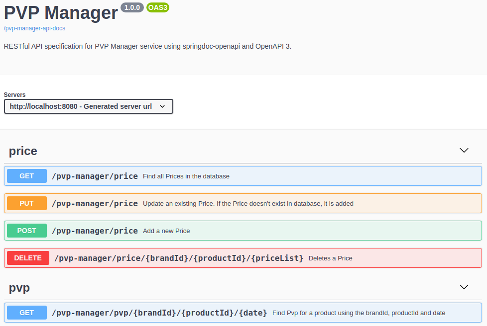
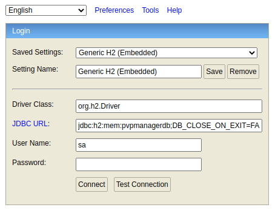
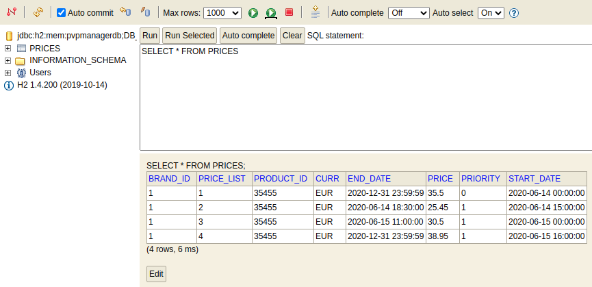

# PVP Manager

This is a Java 8 project that exposes a REST API documented with OpenAPI, developed with SpringBoot 2.3.1 using H2 database for persistency with an initial load of data. It implements the following [scenario](doc/scenario.md). 

It has been done following the MVC design pattern and using [Spring Tool Suite 4](https://spring.io/tools)

## H2 database

For **primary key** of the **PRICES** table has been chosen three fields: BRAND_ID, PRODUCT_ID and PRICE_LIST. This decision has been done thinking that cannot be a row in the table that has the same values for these fields.

Data types for each field:

| FIELD      | DATA TYPE    |
|------------|--------------|
| BRAND_ID   | INTEGER      |
| PRICE_LIST | INTEGER      |
| PRODUCT_ID | INTEGER      |
| PRIORITY   | INTEGER      |
| START_DATE | TIMESTAMP    |
| END_DATE   | TIMESTAMP    |
| PRICE      | DOUBLE       |
| CURR       | VARCHAR(255) |

## Deployment

Once that the repository has been cloned:

```
$ git clone https://github.com/david-rojo/pvp-manager.git
```

import the project in your IDE and to execute it, right click of the mouse in **spring-boot-pvpmanager** folder in Package Explorer window and select *Run as > Spring Boot App*

The project is deployed and ready to verify that implements the requested scenario. You can access to its exposed API here: [http://localhost:8080/pvp-manager-api.html](http://localhost:8080/pvp-manager-api.html)



To verify the scenario, you can test in the OpenAPI User Interface, the get method in **pvp** group writing manually all the values or you can simply click in the following links that use the same data that is used in each test:

* **Test1**: has to return priceList 1
  * input data: ```brandId = 1, productId=35455, date=2020-06-14-10.00.00```
  * URL: [http://localhost:8080/pvp-manager/pvp/1/35455/2020-06-14-10.00.00](http://localhost:8080/pvp-manager/pvp/1/35455/2020-06-14-10.00.00)
  * output data: 
  ```{"priceList":1,"brandId":1,"productId":35455,"startDate":"2020-06-14T00:00:00","endDate":"2020-12-31T23:59:59","price":35.5,"currency":"EUR"}```

* **Test2**:  has to return priceList 2
  * input data: ```brandId = 1, productId=35455, date=2020-06-14-16.00.00```
  * URL: [http://localhost:8080/pvp-manager/pvp/1/35455/2020-06-14-16.00.00](http://localhost:8080/pvp-manager/pvp/1/35455/2020-06-14-16.00.00)
  * output data: 
  ```{"priceList":2,"brandId":1,"productId":35455,"startDate":"2020-06-14T15:00:00","endDate":"2020-06-14T18:30:00","price":25.45,"currency":"EUR"}```
  
* **Test3**:  has to return priceList 1
  * input data: ```brandId = 1, productId=35455, date=2020-06-14-21.00.00```
  * URL: [http://localhost:8080/pvp-manager/pvp/1/35455/2020-06-14-21.00.00](http://localhost:8080/pvp-manager/pvp/1/35455/2020-06-14-21.00.00)
  * output data: 
  ```{"priceList":1,"brandId":1,"productId":35455,"startDate":"2020-06-14T00:00:00","endDate":"2020-12-31T23:59:59","price":35.5,"currency":"EUR"}```
  
* **Test4**:  has to return priceList 3
  * input data: ```brandId = 1, productId=35455, date=2020-06-15-10.00.00```
  * URL: [http://localhost:8080/pvp-manager/pvp/1/35455/2020-06-15-10.00.00](http://localhost:8080/pvp-manager/pvp/1/35455/2020-06-15-10.00.00)
  * output data: 
  ```{"priceList":3,"brandId":1,"productId":35455,"startDate":"2020-06-15T00:00:00","endDate":"2020-06-15T11:00:00","price":30.5,"currency":"EUR"}```
  
* **Test5**: has to return priceList 4
  * input data: ```brandId = 1, productId=35455, date=2020-06-16-21.00.00```
  * URL: [http://localhost:8080/pvp-manager/pvp/1/35455/2020-06-16-21.00.00](http://localhost:8080/pvp-manager/pvp/1/35455/2020-06-16-21.00.00)
  * output data: 
  ```{"priceList":4,"brandId":1,"productId":35455,"startDate":"2020-06-15T16:00:00","endDate":"2020-12-31T23:59:59","price":38.95,"currency":"EUR"}```

### Additional work

Going beyond the scope of the scenario, a full CRUD set of operations has been implemented for the application in order to manage **PRICES** table:

- Add a new price.
- Update an existing price.
- Delete an existing price by ID.
- Get all prices in the table.

Implemention can be examinated in [PvpController](spring-boot-pvpmanager/src/main/java/com/pvpmanager/springboot/app/controller/PvpController.java) class

## Access to h2 console

When the project is deployed, also is available h2 console: [http://localhost:8080/h2-console](http://localhost:8080/h2-console) in order to connect there and verify that the database initially has the requested content. 



This data can be used to login:
```
Driver Class:	org.h2.Driver
JDBC URL:	jdbc:h2:mem:pvpmanagerdb;DB_CLOSE_ON_EXIT=FALSE
User Name:	sa
Password:	password
```
Once we are logged, we can check the content of **PRICES** table executing this query:

```
SELECT * FROM PRICES 
```



## Executing JUnit tests

To run the requested tests we can do it executing this command from **spring-boot-pvpmanager** folder:

```
$ mvn clean package 
```
> **Note:** mvn has to be installed in order to execute the command

Near of the end of the execution log, we can find this line:

```
[INFO] Results:
[INFO] 
[INFO] Tests run: 12, Failures: 0, Errors: 0, Skipped: 0
[INFO] 
```
Detail of each test can be found previously of this text above.

Five tests has been requested in the scenario, testing the rest endpoint, but the project contains also additional tests to check that select operations to database works fine.

JUnitTests classes:

* [PvpApiControllerIntegrationTests](spring-boot-pvpmanager/src/test/java/com/pvpmanager/springboot/app/PvpApiControllerIntegrationTests.java): 
   * test the rest endpoint. 
   * using ```MockMvc```
   * **required** tests.

* [IPriceDaoTests](spring-boot-pvpmanager/src/test/java/com/pvpmanager/springboot/app/IPriceDaoTests.java): 
   * test the select operations to database. 
   * using ```@DataJpaTest```
   * **additional** tests

